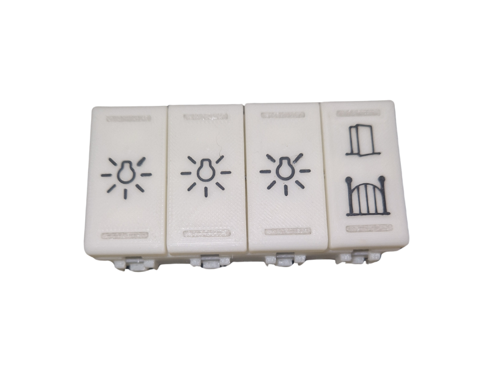

# SebyDBtnX – Open Source Home Automation Device

**SebyDBtnX** is an open-source home automation project designed to integrate seamlessly with the **Bticino MyHome** system.  
It enables control of actuators such as **lights**, **roller shutters**, and **CEN commands** directly on the bus.

---

## ✨ Features
- Control actuators on the Bticino MyHome bus  
- Up to **10 commands per button**  
- Button LED indicates the status of the first command  
- Configurable LED color combinations  
- No external software required for setup  
- Web-based configuration via internal Wi-Fi server  
- **Websocket channel** to monitor bus frame traffic  
- OTA firmware updates supported  
- Currently there are pcb and stl with 8 buttons (4 modules) and 4 buttons (2 modules) available
---

## ⚙️ Hardware Overview
- **MCU:** ESP32-S3FH4R2 SoC  
  - 4MB Flash  
  - Integrated Wi-Fi for setup and OTA updates  
  - Peripherals: UART, IRDA, RMT, etc.  
- **Bus Interface:** STKNX chip  
  - Handles bus communication  
  - Provides onboard switching power supply  
- Compact PCB designed for easy integration  

---

## 🛠️ Setup & Configuration

## Setup WEB Page
to enable wifi AP press left/up and right/down button for 3 seconds.
After connected to wifi AP the setup page is available at local address http://192.168.4.1. The websocket is available at address: ws://192.168.4.1/ws

You must edit the config.h file before compiling by commenting/uncommenting the line with the correct pattern

---

## 🔗 Communication
- **Web page**: Full configuration and command setup  
- **Websocket channel**: Live monitoring of bus traffic  

---

## 📥 Firmware
- Latest firmware releases available under firmware folder  
- Flash via **OTA update** or **USB (UART)**  

